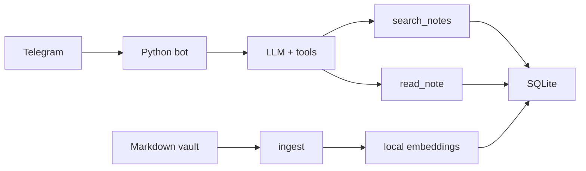

# Obsidian Telegram Knowledge Agent

Telegram bot that answers questions from an Obsidian vault. The model uses two tools — `search_notes` and `read_note` — then replies with citations. Notes that are not in the index are not invented.

## Architecture

1. Markdown files are split into chunks by headings.
2. Chunks are embedded locally with `intfloat/multilingual-e5-small` (CPU) and stored in SQLite.
3. Incoming chat messages run a short tool loop: semantic search, optional full-note read, then the final answer.
4. Generation goes through any OpenAI-compatible API (DeepSeek by default). Embeddings stay on the host.



Personal notes are a bind-mounted `vault/` directory and are not committed. The repo ships a small demo corpus in `data/sample/`.

## Setup

```bash
cp .env.example .env
# set TELEGRAM_BOT_TOKEN and LLM_API_KEY
mkdir -p vault data/index data/models
cp data/sample/*.md vault/
```

Local:

```bash
python -m venv .venv
source .venv/bin/activate   # Windows: .venv\Scripts\activate
pip install -r requirements.txt
python -m src.bot
```

Docker:

```bash
docker compose up -d --build
```

Create a bot with [@BotFather](https://t.me/BotFather). After `/start`, put your numeric user id into `TELEGRAM_ALLOWED_USER_IDS` and recreate the container. New notes go into `vault/`; then send `/reindex`.

To use Groq instead of DeepSeek:

```env
LLM_BASE_URL=https://api.groq.com/openai/v1
LLM_MODEL=llama-3.3-70b-versatile
```

## Tests

```bash
pytest -q
```
